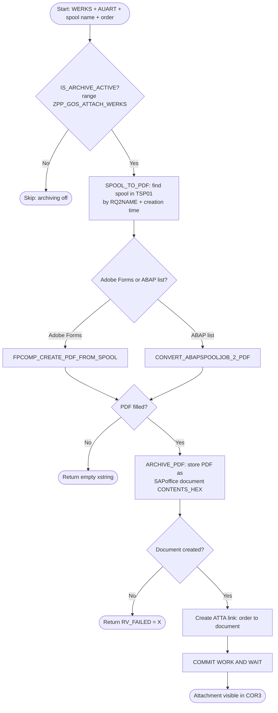

# GOS Order - Anexar Spool em Production Order (PP)

[](https://www.sap.com/)
[](https://en.wikipedia.org/wiki/ABAP)
[](https://help.sap.com/docs/sap-abap-cloud)
[](https://www.sap.com/products/hana.html)
[](https://tools.hana.ondemand.com/)
[](https://help.sap.com/docs/sap_systems)
[](https://help.sap.com/docs/sap_systems)
[](https://en.wikipedia.org/wiki/Manufacturing_execution_system)
[](https://help.sap.com/docs/sap_systems)
[](https://github.com/)

Sistema ABAP SAP para anexar arquivos/documentos em Production/Process Orders utilizando **GOS (Generic Object Services)** via `CL_BINARY_RELATION` (relação ATTA).

## 📋 Visão Geral

Este repositório demonstra como integrar documentos e arquivos em uma Production Order do módulo PP (Planejamento de Produção) usando **GOS (Generic Object Services)**. Um caso de uso comum é anexar um relatório de spool já existente (SP02) como comprovante na ordem de produção.

### Conceitos Principais

- **GOS (Generic Object Services)**: Framework do SAP que permite anexar documentos, notas e links a objetos de negócios
- **CL_BINARY_RELATION**: Classe para criar a relação (link) entre o documento e a ordem
- **Process / Production Order (BUS0001)**: Objeto de negócio do módulo PP (Planejamento de Produção)
- **Spool (SP02)**: Documento já processado/impresso no sistema (localizado por nome + hora de criação)
- **Adobe Forms / ABAP list**: Origem do spool — o PDF é montado via `FPCOMP_CREATE_PDF_FROM_SPOOL` (Adobe Forms) ou, como fallback, `CONVERT_ABAPSPOOLJOB_2_PDF` (ABAP list)
- **SAPoffice**: Repositório de documentos para armazenar PDFs e anexos
- **Relação ATTA**: Ligação binária que conecta um documento a uma ordem de produção
- **Ativação por Customizing**: Range de valores fixos `ZPP_GOS_ATTACH_<WERKS>` define para quais tipos de ordem (AUART) o arquivamento está ligado em cada centro (WERKS)

---

## 🔄 Fluxo do Processo

A classe expõe **3 métodos estáticos** que, em conjunto, cobrem o fluxo completo:



### Passo a Passo:

| Etapa | Método | Função / Lógica SAP | Saída |
|-------|--------|---------------------|-------|
| 1️⃣ **Ativação** | `IS_ARCHIVE_ACTIVE` | Range fixo `ZPP_GOS_ATTACH_<WERKS>` (via `zcl_ca_utils=>get_fixed_param_range`) | `RV_ACTIVE` (ABAP_BOOL) |
| 2️⃣ **Localização + Conversão** | `SPOOL_TO_PDF` | Busca em `TSP01` por `RQ2NAME` + `RQCRETIME`; `FPCOMP_CREATE_PDF_FROM_SPOOL` (Adobe) com fallback `CONVERT_ABAPSPOOLJOB_2_PDF` | `RV_PDF` (xstring) |
| 3️⃣ **Armazenamento + Ligação** | `ARCHIVE_PDF` | `SO_DOCUMENT_INSERT_API1` (CONTENTS_HEX) + `CL_BINARY_RELATION=>create_link()` (ATTA) | `RV_FAILED` (ABAP_BOOL) |

---

## 🎯 Objetivo

Criar um programa ABAP que:
1. Localiza uma Production Order existente (CORN)
2. Recupera um arquivo de spool (SP02) já existente
3. Anexa esse arquivo/documento à Production Order usando GOS

---

## 🔧 Pré-requisitos

- Sistema SAP com módulo PP ativo
- Classe `CL_GOS_MANAGER` disponível (versão 4.7 ou superior)
- Production Order válida (CORN)
- Spool job já processado e disponível (SP02)
- Acesso a transação SP01/SP02 (Spool)

---

## 📝 Código ABAP - Solução Completa

### Classe de Referência: ZCL_PP_GOS_ARCHIVE

A versão produtiva é uma classe global (`ZCL_PP_GOS_ARCHIVE`) com 3 métodos estáticos. O arquivo [code/y_gos.abap](code/y_gos.abap) traz esse mesmo código como **classe local** (`lcl_gos_archive`) dentro de um report, para que todo o fluxo possa ser lido em um único arquivo de exemplo.

> ℹ️ A API real é orientada a **flags de retorno** (`RV_ACTIVE` / `RV_FAILED`) e a um **xstring** de PDF — não usa exceções. O report de exemplo apenas encadeia os 3 métodos e mostra mensagens.

```abap
*&---------------------------------------------------------------------*
*& Report  ZPP_GOS_SPOOL_TO_ORDER  (local class example)
*&---------------------------------------------------------------------*
*& Local mirror of ZCL_PP_GOS_ARCHIVE.
*& Flow : 1) IS_ARCHIVE_ACTIVE  2) SPOOL_TO_PDF  3) ARCHIVE_PDF
*&---------------------------------------------------------------------*
REPORT zpp_gos_spool_to_order.

CLASS lcl_gos_archive DEFINITION FINAL.
  PUBLIC SECTION.

    "! True when archiving is on for the plant / order type combination.
    CLASS-METHODS is_archive_active
      IMPORTING iv_werks         TYPE werks_d
                iv_auart         TYPE auart
      RETURNING VALUE(rv_active) TYPE abap_bool.

    "! Finds the spool (by name + creation time) and returns it as a PDF.
    "! Adobe Forms first, ABAP list as fallback.
    CLASS-METHODS spool_to_pdf
      IMPORTING iv_rq2name    TYPE rspo2name
                iv_rqcretime  TYPE rspocrtime
      RETURNING VALUE(rv_pdf) TYPE xstring.

    "! Stores the PDF and links it to the order ('ATTA'). True on failure.
    CLASS-METHODS archive_pdf
      IMPORTING iv_pdf           TYPE xstring
                iv_title         TYPE so_obj_des
                iv_aufnr         TYPE aufnr
                iv_object_type   TYPE sibftypeid DEFAULT 'BUS0001'
      RETURNING VALUE(rv_failed) TYPE abap_bool.

ENDCLASS.

CLASS lcl_gos_archive IMPLEMENTATION.

  METHOD is_archive_active.
    DATA: lv_var   TYPE rvari_vnam,
          lr_auart TYPE RANGE OF auart.

    " Customizing range maintained per plant: ZPP_GOS_ATTACH_<WERKS>
    lv_var = |{ 'ZPP_GOS_ATTACH_' }{ iv_werks }|.

    zcl_ca_utils=>get_fixed_param_range(
      EXPORTING  iv_name              = lv_var
      IMPORTING  er_range             = lr_auart
      EXCEPTIONS wrong_exp_table_type = 1
                 OTHERS               = 2 ).

    IF sy-subrc <> 0 OR lr_auart[] IS INITIAL OR
       NOT iv_auart IN lr_auart.
      rv_active = abap_false.
    ELSE.
      rv_active = abap_true.
    ENDIF.
  ENDMETHOD.

  METHOD spool_to_pdf.
    DATA: ls_rq        TYPE tsp01sys,
          lt_partlist  TYPE TABLE OF adspartdesc,
          ls_partline  LIKE LINE OF lt_partlist,
          lv_confile   TYPE string,
          lt_pdf       TYPE STANDARD TABLE OF tline,
          lv_bytecount TYPE i.

    CLEAR rv_pdf.

    " 1) Get the spool number from TSP01 (retry: spooling may lag)
    DO 5 TIMES.
      SELECT rqident, rqclient, rq0name, rqo1name
        FROM tsp01 UP TO 1 ROWS
        INTO ( @ls_rq-rqident, @ls_rq-rqclient,
               @ls_rq-rq0name, @ls_rq-rqo1name )
       WHERE rqclient  =   @sy-mandt
         AND rq0name   =   'PBFORM'
         AND rq2name   =   @iv_rq2name
         AND rqowner   =   @sy-uname
         AND rqfinal   IN ( 'X', 'C' )
         AND rqcretime GE  @iv_rqcretime
         AND rqerror   =   0
       ORDER BY rqident.                                 "#EC CI_NOFIELD
      ENDSELECT.
      IF sy-subrc = 0.
        EXIT.
      ENDIF.
    ENDDO.

    IF ls_rq-rqident IS INITIAL.
      RETURN.
    ENDIF.

    " 2) Adobe Forms spool -> PDF (FPCOMP_CREATE_PDF_FROM_SPOOL)
    CALL FUNCTION 'RSPO_ADSP_FILL_PARTLIST'
      EXPORTING rq       = ls_rq
      TABLES    partlist = lt_partlist.

    IF lt_partlist[] IS NOT INITIAL.
      READ TABLE lt_partlist INDEX 1 INTO ls_partline.

      CALL FUNCTION 'FPCOMP_CREATE_PDF_FROM_SPOOL'
        EXPORTING  i_spoolid      = ls_rq-rqident
                   i_partnum      = ls_partline-adsnum
        IMPORTING  e_pdf          = rv_pdf
                   e_pdf_file     = lv_confile
        EXCEPTIONS ads_error      = 1
                   usage_error    = 2
                   system_error   = 3
                   internal_error = 4
                   OTHERS         = 5.    "#EC CI_SUBRC ##FM_SUBRC_OK
      IF sy-subrc <> 0.
        CLEAR rv_pdf.
      ENDIF.
    ENDIF.

    IF rv_pdf IS NOT INITIAL.
      RETURN.
    ENDIF.

    " 3) Fallback: interpret the spool as an ABAP list
    CALL FUNCTION 'CONVERT_ABAPSPOOLJOB_2_PDF'
      EXPORTING  src_spoolid              = ls_rq-rqident
                 no_dialog                = abap_true
      IMPORTING  pdf_bytecount            = lv_bytecount
      TABLES     pdf                      = lt_pdf
      EXCEPTIONS err_no_abap_spooljob     = 1
                 err_no_spooljob          = 2
                 err_no_permission        = 3
                 err_conv_not_possible    = 4
                 err_bad_destdevice       = 5
                 user_cancelled           = 6
                 err_spoolerror           = 7
                 err_temseerror           = 8
                 err_btcjob_open_failed   = 9
                 err_btcjob_submit_failed = 10
                 err_btcjob_close_failed  = 11
                 OTHERS                   = 12.
    IF sy-subrc <> 0.
      RETURN.
    ENDIF.

    " 4) Binary table -> xstring
    CALL FUNCTION 'SCMS_BINARY_TO_XSTRING'
      EXPORTING input_length = lv_bytecount
      IMPORTING buffer       = rv_pdf
      TABLES    binary_tab   = lt_pdf.
  ENDMETHOD.

  METHOD archive_pdf.
    DATA: ls_folder  TYPE soodk,
          lv_obj_id  TYPE so_obj_id,
          lv_size    TYPE i,
          ls_docdata TYPE sodocchgi1,
          ls_docinfo TYPE sofolenti1,
          ls_bo      TYPE sibflporb,
          ls_doc     TYPE sibflporb.

    rv_failed = abap_false.

    IF iv_pdf IS INITIAL.
      rv_failed = abap_true.
      RETURN.
    ENDIF.

    " Root folder of the current SAPoffice user
    CALL FUNCTION 'SO_FOLDER_ROOT_ID_GET'
      EXPORTING  region    = 'B'
      IMPORTING  folder_id = ls_folder
      EXCEPTIONS OTHERS    = 1.
    IF sy-subrc <> 0.
      rv_failed = abap_true.
      RETURN.
    ENDIF.

    " Binary content as SOLIX (raw hex - no character conversion)
    lv_size = xstrlen( iv_pdf ).
    DATA(lt_solix) = cl_bcs_convert=>xstring_to_solix( iv_xstring = iv_pdf ).

    ls_docdata-obj_name  = 'SPOOLPDF'.
    ls_docdata-obj_descr = iv_title.
    ls_docdata-obj_langu = sy-langu.
    ls_docdata-doc_size  = lv_size.
    lv_obj_id            = ls_folder.

    CALL FUNCTION 'SO_DOCUMENT_INSERT_API1'
      EXPORTING  folder_id                  = lv_obj_id
                 document_data              = ls_docdata
                 document_type              = 'PDF'
      IMPORTING  document_info              = ls_docinfo
      TABLES     contents_hex               = lt_solix
      EXCEPTIONS folder_not_exist           = 1
                 document_type_not_exist    = 2
                 operation_no_authorization = 3
                 parameter_error            = 4
                 x_error                    = 5
                 enqueue_error              = 6
                 OTHERS                     = 7.
    IF sy-subrc <> 0.
      rv_failed = abap_true.
      RETURN.
    ENDIF.

    ls_bo  = VALUE #( instid = iv_aufnr
                      typeid = iv_object_type
                      catid  = 'BO' ).
    ls_doc = VALUE #( instid = ls_docinfo-doc_id
                      typeid = 'MESSAGE'
                      catid  = 'BO' ).

    TRY.
        cl_binary_relation=>create_link(
          is_object_a = ls_bo
          is_object_b = ls_doc
          ip_reltype  = 'ATTA' ).
      CATCH cx_obl_parameter_error cx_obl_model_error cx_obl_internal_error.
        rv_failed = abap_true.
        RETURN.
    ENDTRY.

    COMMIT WORK AND WAIT.
  ENDMETHOD.

ENDCLASS.

"=====================================================================
" Selection screen + execution (demo wiring of the 3 steps)
"=====================================================================
PARAMETERS:
  p_werks  TYPE werks_d     OBLIGATORY,
  p_auart  TYPE auart       OBLIGATORY,
  p_rq2nam TYPE rspo2name   OBLIGATORY,           " spool name (RQ2NAME)
  p_rqtime TYPE rspocrtime  OBLIGATORY,           " spool creation time (lower bound)
  p_aufnr  TYPE aufnr       OBLIGATORY,
  p_botype TYPE sibftypeid  DEFAULT 'BUS0001',    " process order business object
  p_descr  TYPE so_obj_des  DEFAULT 'Attachment from spool'.

START-OF-SELECTION.

  IF lcl_gos_archive=>is_archive_active( iv_werks = p_werks
                                         iv_auart = p_auart ) = abap_false.
    MESSAGE |Archiving not active for plant { p_werks } / order type { p_auart }.| TYPE 'S'.
    RETURN.
  ENDIF.

  DATA(lv_pdf) = lcl_gos_archive=>spool_to_pdf( iv_rq2name   = p_rq2nam
                                                iv_rqcretime = p_rqtime ).
  IF lv_pdf IS INITIAL.
    MESSAGE |Spool { p_rq2nam } could not be converted to PDF.| TYPE 'E'.
    RETURN.
  ENDIF.

  IF lcl_gos_archive=>archive_pdf( iv_pdf         = lv_pdf
                                   iv_title       = p_descr
                                   iv_aufnr       = p_aufnr
                                   iv_object_type = p_botype ) = abap_true.
    MESSAGE |Could not attach the PDF to order { p_aufnr ALPHA = OUT }.| TYPE 'E'.
  ELSE.
    MESSAGE |Attachment created on order { p_aufnr ALPHA = OUT }.| TYPE 'S'.
  ENDIF.
```

**Recursos principais:**
- ✅ API estática de 3 métodos (`is_archive_active` / `spool_to_pdf` / `archive_pdf`)
- ✅ Ativação por Customizing (range `ZPP_GOS_ATTACH_<WERKS>` por centro/tipo de ordem)
- ✅ Localização do spool por nome (`RQ2NAME`) + hora de criação, com retry
- ✅ Adobe Forms (`FPCOMP_CREATE_PDF_FROM_SPOOL`) com fallback para ABAP list
- ✅ Armazenamento binário em SAPoffice via `SO_DOCUMENT_INSERT_API1` (CONTENTS_HEX)
- ✅ Ligação ATTA via `CL_BINARY_RELATION`
- ✅ Retorno por flags (sem exceções) — pronto para S/4HANA 2023

---

## 🔑 Parâmetros de Entrada (Selection Screen)

| Parâmetro | Tipo | Obrigatório | Descrição | Exemplo |
|-----------|------|---------|-----------|---------|
| `p_werks` | WERKS_D | ✅ Sim | Centro (define o range de Customizing) | 1000 |
| `p_auart` | AUART | ✅ Sim | Tipo de ordem (verificado no range) | PI01 |
| `p_rq2nam` | RSPO2NAME | ✅ Sim | Nome do spool (RQ2NAME) a localizar | ZPP_FORM |
| `p_rqtime` | RSPOCRTIME | ✅ Sim | Hora de criação do spool (limite inferior) | 143000 |
| `p_aufnr` | AUFNR | ✅ Sim | Número da Production/Process Order | 0000100001 |
| `p_botype` | SIBFTYPEID | ❌ Não | Tipo de objeto (BO type) | BUS0001 (padrão) |
| `p_descr` | SO_OBJ_DES | ❌ Não | Descrição do anexo | "Attachment from spool" |

---

## 🏢 Objetos de Negócio (Business Objects) Suportados

Tipos de objetos que podem ter anexos via GOS:

| BO Type | Descrição | Transação |
|---------|-----------|-----------|
| `BUS0001` | Process / Production Order (padrão da classe) | COR3 / CO03 |
| `BUS2005` | Production Order / Manufacturing Order | CO02 |
| `BUS2009` | Purchase Order Header | ME22N |
| `BUS2032` | Sales Order | VA02 |
| `BUS1001006` | Material Master | MM02 |
| `BUS1015005` | Project | PS01 |
| `BUS1041001` | Cost Center | KS01 |

---

## 🔧 Funções SAP Utilizadas

### Localização do Spool

| Função / Tabela | Uso |
|-----------------|-----|
| `TSP01` | Localizar o spool por `RQ2NAME` + `RQCRETIME` (owner = usuário atual) |
| `RSPO_ADSP_FILL_PARTLIST` | Obter a lista de partes (Adobe Document Services) do spool |

### Conversão de Spool para PDF

| Função | Uso | Suporta |
|--------|-----|---------|
| `FPCOMP_CREATE_PDF_FROM_SPOOL` | Montar PDF a partir de spool de Adobe Forms | Adobe Forms (PDF-based) |
| `CONVERT_ABAPSPOOLJOB_2_PDF` | Converter relatórios ABAP list para PDF (fallback) | Relatórios simples em ABAP |
| `SCMS_BINARY_TO_XSTRING` | Converter tabela binária para xstring | Conversão de tipos |

### Armazenamento em SAPoffice

| Função | Uso |
|--------|-----|
| `SO_FOLDER_ROOT_ID_GET` | Obter pasta raiz do usuário em SAPoffice |
| `SO_DOCUMENT_INSERT_API1` | Inserir documento binário em SAPoffice |

### Ligação de Objetos (GOS)

| Classe | Método | Uso |
|--------|--------|-----|
| `CL_BINARY_RELATION` | `create_link()` | Criar relação ATTA entre ordem e documento |
| `CL_BCS_CONVERT` | `xstring_to_solix()` | Converter xstring para formato SOLIX (SAPoffice) |

---

---

## ⚠️ Notas Importantes & Troubleshooting

### ✅ Pré-requisitos de Segurança e Configuração

| Item | Verificação | Comando/Transação |
|------|-----------|------------------|
| 📧 **SAPoffice Inicializado** | Usuário deve ter pasta em SAPoffice | SBWP (SAPoffice) |
| 🔐 **Permissões SAPoffice** | Roles com S_OC_* (Create, Edit, Delete) | SUIM (User Info) |
| 🏭 **Acesso à Production Order** | Permissão de leitura em AUFK | AUFK (table check) |
| 🗂️ **Tipo de Objeto Correto** | Confirmar `p_botype` (padrão BUS0001) | SRGBTBREL (relações) |
| ⚙️ **Range de Ativação** | Manter `ZPP_GOS_ATTACH_<WERKS>` com os tipos de ordem (AUART) | STVARV / Customizing |

### 🐛 Erros Comuns e Soluções

| Erro | Causa | Solução |
|------|-------|--------|
| `err_no_abap_spooljob = 1` | Spool ID inválido ou não é ABAP list | Verificar SP02 (transação SP01) |
| `err_no_permission = 3` | Sem permissão para ler spool | Verificar SPRO / Authorizations (S_SPO_*) |
| `x_error = 5` | SAPoffice não inicializado ou autorização | Acessar SBWP / Executar Setup de SAPoffice |
| `Document not found` | Ligação ATTA falhou | Verificar tipo BO em SRGBTBREL |

### 📝 Checklist Antes de Executar

- [ ] Range `ZPP_GOS_ATTACH_<WERKS>` mantido para o centro/tipo de ordem
- [ ] Production Order existe (AUFK)
- [ ] Spool foi processado (SP02 - transação SP01) com o `RQ2NAME` esperado
- [ ] Usuário tem pasta SAPoffice (SBWP)
- [ ] Usuário tem role com S_OC_* permissions
- [ ] Sistema é S/4HANA ou ECC 6.0+
- [ ] `p_botype` confirmado com `SRGBTBREL` (tabela de relações)

---

## 🚀 Como Usar Este Repositório

1. **Clone o repositório**
   ```bash
   git clone https://github.com/seu-usuario/gos-order.git
   cd gos-order
   ```

2. **Copie o programa** para seu ambiente SAP:
   - Acesse a transação **SE38** (Editor ABAP)
   - Crie um novo programa: **ZPP_GOS_SPOOL_TO_ORDER**
   - Cole o código completo acima
   - Execute **Ctrl+S** e **F9** para testar

3. **Configure os parâmetros**:
   - **p_werks** / **p_auart**: Centro e tipo de ordem (checados no range de ativação)
   - **p_rq2nam** / **p_rqtime**: Nome e hora de criação do spool (SP01)
   - **p_aufnr**: Número da Production/Process Order (AUFK)
   - **p_botype**: Tipo de objeto (padrão BUS0001 para Process Order)
   - **p_descr**: Descrição do anexo

4. **Verifique o resultado**:
   - Abra a Production Order em **CO03** (modo visualização)
   - Clique em **Attachments** ou vá para aba **Attachments** (COR3)
   - O arquivo PDF deve aparecer na lista

---

## 📖 Referências SAP & Documentação

### Transações Principais

| Transação | Descrição | Uso |
|-----------|-----------|-----|
| **SE38** | Editor ABAP | Criar e testar programa |
| **CO02** | Alterar Production Order | Editar ordem, ver anexos |
| **CO03** | Visualizar Production Order | Ver anexos (COR3 - aba Attachments) |
| **SP01** | Visualizador de Spool | Obter ID do spool, preview |
| **SBWP** | SAPoffice Inbox | Verificar inicialização, pastas |
| **SRGBTBREL** | Administração de Relações GOS | Confirmar tipos de objetos e relações |

### Funções & Classes

- [CONVERT_ABAPSPOOLJOB_2_PDF](https://help.sap.com/) - Converter ABAP list para PDF
- [CONVERT_OTFSPOOLJOB_2_PDF](https://help.sap.com/) - Converter OTF para PDF
- [SO_DOCUMENT_INSERT_API1](https://help.sap.com/) - API SAPoffice
- [CL_BINARY_RELATION](https://help.sap.com/) - Gerenciador de relações GOS
- [CL_BCS_CONVERT](https://help.sap.com/) - Conversão de tipos binários

### Tabelas de Interesse

- **AUFK** - Production Order Header
- **TSP01** - Spool Request Header (localização por RQ2NAME / RQCRETIME)
- **SRGBTBREL** - Definições de Relações GOS
- **SO_ENTRYID** - Documentos SAPoffice

---

## 🤝 Contribuições

Este repositório é um exemplo educacional. Para sugestões ou melhorias, abra uma issue ou pull request.

---

## 📄 Licença

Open Source - Use livremente em seus projetos SAP.

---

**Versão:** 3.0  
**Última atualização:** 2026-06-26  
**Status:** ✅ Production-Ready (S/4HANA 2023 / ABAP Platform 2023)  
**Autor:** JESUSEDM
