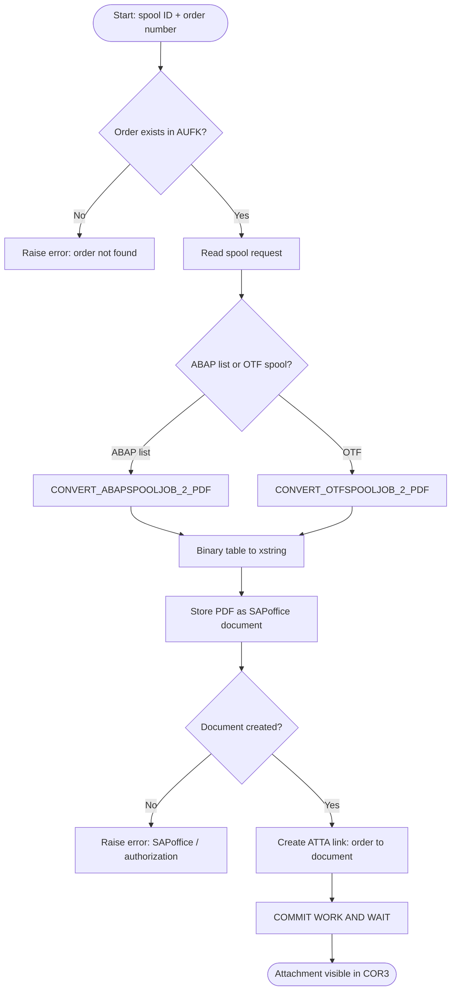

# GOS Order - Anexar Spool em Production Order (PP)

[](https://www.sap.com/)
[](https://en.wikipedia.org/wiki/ABAP)
[](https://help.sap.com/docs/sap-abap-cloud)
[](https://www.sap.com/products/hana.html)
[](https://tools.hana.ondemand.com/)
[](https://help.sap.com/docs/sap_systems)
[](https://help.sap.com/docs/sap_systems)
[](https://en.wikipedia.org/wiki/Manufacturing_execution_system)
[](https://help.sap.com/docs/sap_systems)
[](https://github.com/)

Sistema ABAP SAP para anexar arquivos/documentos em Production Orders (CORN) utilizando **GOS (Generic Object Services)** via classe `CL_GOS_MANAGER`.

## 📋 Visão Geral

Este repositório demonstra como integrar documentos e arquivos em uma Production Order do módulo PP (Planejamento de Produção) usando **GOS (Generic Object Services)**. Um caso de uso comum é anexar um relatório de spool já existente (SP02) como comprovante na ordem de produção.

### Conceitos Principais

- **GOS (Generic Object Services)**: Framework do SAP que permite anexar documentos, notas e links a objetos de negócios
- **CL_GOS_MANAGER / CL_BINARY_RELATION**: Classes para gerenciar anexos e relações entre objetos
- **Production Order (CORN / BUS2005)**: Objeto de negócio do módulo PP (Planejamento de Produção)
- **Spool (SP02)**: Documento já processado/impresso no sistema
- **SAPoffice**: Repositório de documentos para armazenar PDFs e anexos
- **Relação ATTA**: Ligação binária que conecta um documento a uma ordem de produção

---

## 🔄 Fluxo do Processo

O processo de anexar um spool a uma ordem é composto por **4 etapas principais**:



### Passo a Passo:

| Etapa | Ação | Função SAP | Saída |
|-------|------|-----------|-------|
| 1️⃣ **Validação** | Verificar se ordem existe em AUFK | SELECT AUFK | ordem validada |
| 2️⃣ **Conversão** | Converter spool (ABAP list ou OTF) para PDF | `CONVERT_ABAPSPOOLJOB_2_PDF` ou `CONVERT_OTFSPOOLJOB_2_PDF` | xstring (PDF binário) |
| 3️⃣ **Armazenamento** | Gravar PDF como documento em SAPoffice | `SO_DOCUMENT_INSERT_API1` | document_id (SO_ENTRYID) |
| 4️⃣ **Ligação** | Criar relação ATTA entre ordem e documento | `CL_BINARY_RELATION=>create_link()` | anexo aparece em COR3 |

---

## 🎯 Objetivo

Criar um programa ABAP que:
1. Localiza uma Production Order existente (CORN)
2. Recupera um arquivo de spool (SP02) já existente
3. Anexa esse arquivo/documento à Production Order usando GOS

---

## 🔧 Pré-requisitos

- Sistema SAP com módulo PP ativo
- Classe `CL_GOS_MANAGER` disponível (versão 4.7 ou superior)
- Production Order válida (CORN)
- Spool job já processado e disponível (SP02)
- Acesso a transação SP01/SP02 (Spool)

---

## 📝 Código ABAP - Solução Completa

### Programa Profissional: ZPP_GOS_SPOOL_TO_ORDER

Programa completo e produção-ready (SAP S/4HANA 2023 / ABAP Platform 2023):

```abap
*&---------------------------------------------------------------------*
*& Report  ZPP_GOS_SPOOL_TO_ORDER
*&---------------------------------------------------------------------*
*& Purpose : Take a spool request, convert it to PDF and attach it to a
*&           manufacturing/process order as a GOS attachment (ATTA).
*& System  : SAP S/4HANA 2023 (ABAP Platform 2023)
*& Author  : JESUSEDM
*& Note    : GOS is a Classic API (Clean Core level B, on-premise only).
*&           Local class now; to be promoted to a global class later.
*& Flow    : 1) validate order  2) spool -> PDF  3) store PDF in SAPoffice
*&           4) link document to order (binary relation 'ATTA')
*&---------------------------------------------------------------------*
REPORT zpp_gos_spool_to_order.

"=====================================================================
" Local exception (to be replaced by a global ZCX_* in the final class)
"=====================================================================
CLASS lcx_gos_error DEFINITION INHERITING FROM cx_static_check FINAL.
  PUBLIC SECTION.
    METHODS constructor IMPORTING iv_text TYPE string.
    METHODS get_text REDEFINITION.
  PRIVATE SECTION.
    DATA mv_text TYPE string.
ENDCLASS.

CLASS lcx_gos_error IMPLEMENTATION.
  METHOD constructor.
    super->constructor( ).
    mv_text = iv_text.
  ENDMETHOD.
  METHOD get_text.
    result = mv_text.
  ENDMETHOD.
ENDCLASS.

"=====================================================================
" Local GOS service class
"=====================================================================
CLASS lcl_gos_attachment DEFINITION FINAL CREATE PRIVATE.
  PUBLIC SECTION.
    CLASS-METHODS create_instance
      RETURNING VALUE(ro_instance) TYPE REF TO lcl_gos_attachment.

    "! Reads the spool, converts it to PDF and creates the GOS
    "! attachment on the given order.
    METHODS create_from_spool
      IMPORTING iv_spool_id    TYPE rspoid
                iv_order       TYPE aufnr
                iv_object_type TYPE sibftypeid DEFAULT 'BUS2005'
                iv_title       TYPE so_obj_des DEFAULT 'Attachment from spool'
      RAISING   lcx_gos_error.

  PRIVATE SECTION.
    "! Converts a spool request (ABAP list or OTF) into a PDF xstring.
    METHODS spool_to_pdf
      IMPORTING iv_spool_id  TYPE rspoid
      EXPORTING ev_pdf       TYPE xstring
                ev_bytecount TYPE i
      RAISING   lcx_gos_error.

    "! Stores a PDF xstring as a SAPoffice document and returns its id.
    METHODS store_pdf_document
      IMPORTING iv_pdf        TYPE xstring
                iv_bytecount  TYPE i
                iv_title      TYPE so_obj_des
                iv_filename   TYPE string
      RETURNING VALUE(rv_doc_id) TYPE so_entryid
      RAISING   lcx_gos_error.
ENDCLASS.

CLASS lcl_gos_attachment IMPLEMENTATION.

  METHOD create_instance.
    ro_instance = NEW lcl_gos_attachment( ).
  ENDMETHOD.

  METHOD spool_to_pdf.
    DATA lt_pdf TYPE STANDARD TABLE OF tline.

    " 1) Try to interpret the spool as an ABAP list
    CALL FUNCTION 'CONVERT_ABAPSPOOLJOB_2_PDF'
      EXPORTING  src_spoolid              = iv_spool_id
                 no_dialog                = abap_true
      IMPORTING  pdf_bytecount            = ev_bytecount
      TABLES     pdf                      = lt_pdf
      EXCEPTIONS err_no_abap_spooljob     = 1
                 err_no_spooljob          = 2
                 err_no_permission        = 3
                 err_conv_not_possible    = 4
                 err_bad_destdevice       = 5
                 user_cancelled           = 6
                 err_spoolerror           = 7
                 err_temseerror           = 8
                 err_btcjob_open_failed   = 9
                 err_btcjob_submit_failed = 10
                 err_btcjob_close_failed  = 11
                 OTHERS                   = 12.

    " 2) Not an ABAP list -> fall back to OTF (SAPscript / Smart Forms)
    IF sy-subrc = 4.
      CLEAR: lt_pdf, ev_bytecount.
      CALL FUNCTION 'CONVERT_OTFSPOOLJOB_2_PDF'
        EXPORTING  src_spoolid           = iv_spool_id
                   no_dialog             = abap_true
        IMPORTING  pdf_bytecount         = ev_bytecount
        TABLES     pdf                   = lt_pdf
        EXCEPTIONS err_no_otf_spooljob   = 1
                   err_spoolerror        = 2
                   err_no_permission     = 3
                   err_conv_not_possible = 4
                   err_bad_dstdevice     = 5
                   user_cancelled        = 6
                   OTHERS                = 7.
      IF sy-subrc <> 0.
        RAISE EXCEPTION TYPE lcx_gos_error
          EXPORTING iv_text = |Spool { iv_spool_id } (OTF) could not be converted to PDF. SY-SUBRC={ sy-subrc }|.
      ENDIF.
    ELSEIF sy-subrc <> 0.
      RAISE EXCEPTION TYPE lcx_gos_error
        EXPORTING iv_text = |Spool { iv_spool_id } could not be converted to PDF. SY-SUBRC={ sy-subrc }|.
    ENDIF.

    " 3) Binary table -> xstring (byte count guarantees an intact PDF)
    CALL FUNCTION 'SCMS_BINARY_TO_XSTRING'
      EXPORTING input_length = ev_bytecount
      IMPORTING buffer       = ev_pdf
      TABLES    binary_tab   = lt_pdf.

    IF ev_pdf IS INITIAL.
      RAISE EXCEPTION TYPE lcx_gos_error
        EXPORTING iv_text = |PDF content is empty after converting spool { iv_spool_id }.|.
    ENDIF.
  ENDMETHOD.

  METHOD store_pdf_document.
    " Get the root folder of the current SAPoffice user
    DATA ls_folder TYPE soodk.
    CALL FUNCTION 'SO_FOLDER_ROOT_ID_GET'
      EXPORTING  region    = 'B'
      IMPORTING  folder_id = ls_folder
      EXCEPTIONS OTHERS    = 1.
    IF sy-subrc <> 0.
      RAISE EXCEPTION TYPE lcx_gos_error
        EXPORTING iv_text = |Could not read SAPoffice root folder (user initialized in SBWP?).|.
    ENDIF.

    " Header info: file name the attachment will be opened with
    DATA lt_header TYPE STANDARD TABLE OF solisti1.
    APPEND VALUE #( line = |&SO_FILENAME={ iv_filename }| ) TO lt_header.

    " Document attributes
    DATA ls_docdata TYPE sodocchgi1.
    ls_docdata-obj_name  = 'SPOOLPDF'.
    ls_docdata-obj_descr = iv_title.
    ls_docdata-obj_langu = sy-langu.
    ls_docdata-doc_size  = iv_bytecount.        " mandatory for an intact PDF

    " Binary content as SOLIX
    DATA(lt_solix) = cl_bcs_convert=>xstring_to_solix( iv_xstring = iv_pdf ).

    DATA ls_docinfo TYPE sofolenti1.
    CALL FUNCTION 'SO_DOCUMENT_INSERT_API1'
      EXPORTING  folder_id                  = ls_folder
                 document_data              = ls_docdata
                 document_type              = 'PDF'
      IMPORTING  document_info              = ls_docinfo
      TABLES     object_header              = lt_header
                 contents_hex               = lt_solix
      EXCEPTIONS folder_not_exist           = 1
                 document_type_not_exist    = 2
                 operation_no_authorization = 3
                 parameter_error            = 4
                 x_error                    = 5
                 enqueue_error              = 6
                 OTHERS                     = 7.
    IF sy-subrc <> 0.
      RAISE EXCEPTION TYPE lcx_gos_error
        EXPORTING iv_text = |Could not create SAPoffice document. SY-SUBRC={ sy-subrc } | &&
                            |(5=x_error: check SBWP / authorizations S_OC_*).|.
    ENDIF.

    rv_doc_id = ls_docinfo-doc_id.
  ENDMETHOD.

  METHOD create_from_spool.
    " 1) Validate the order
    DATA(lv_aufnr) = CONV aufnr( |{ iv_order ALPHA = IN }| ).
    SELECT SINGLE aufnr FROM aufk INTO @DATA(lv_dummy) WHERE aufnr = @lv_aufnr.
    IF sy-subrc <> 0.
      RAISE EXCEPTION TYPE lcx_gos_error
        EXPORTING iv_text = |Order { lv_aufnr ALPHA = OUT } not found (AUFK).|.
    ENDIF.

    " 2) Spool -> PDF
    spool_to_pdf( EXPORTING iv_spool_id  = iv_spool_id
                  IMPORTING ev_pdf       = DATA(lv_pdf)
                            ev_bytecount = DATA(lv_size) ).

    " 3) Store the PDF as a SAPoffice document
    DATA(lv_doc_id) = store_pdf_document(
      iv_pdf       = lv_pdf
      iv_bytecount = lv_size
      iv_title     = iv_title
      iv_filename  = |ATTACH_{ lv_aufnr }.PDF| ).

    " 4) Link the document to the order as a GOS attachment (ATTA)
    DATA: ls_bo  TYPE sibflporb,
          ls_doc TYPE sibflporb.

    ls_bo  = VALUE #( instid = lv_aufnr
                      typeid = iv_object_type
                      catid  = 'BO' ).
    ls_doc = VALUE #( instid = lv_doc_id
                      typeid = 'MESSAGE'
                      catid  = 'BO' ).

    TRY.
        cl_binary_relation=>create_link(
          is_object_a = ls_bo
          is_object_b = ls_doc
          ip_reltype  = 'ATTA' ).
      CATCH cx_obl_parameter_error cx_obl_model_error cx_obl_internal_error INTO DATA(lx_obl).
        RAISE EXCEPTION TYPE lcx_gos_error
          EXPORTING iv_text = |Could not link attachment to order: { lx_obl->get_text( ) }|.
    ENDTRY.

    COMMIT WORK AND WAIT.
  ENDMETHOD.

ENDCLASS.

"=====================================================================
" Selection screen + execution
"=====================================================================
PARAMETERS:
  p_spool  TYPE rspoid      OBLIGATORY,
  p_aufnr  TYPE aufnr       OBLIGATORY,
  p_botype TYPE sibftypeid  DEFAULT 'BUS2005',   " confirm BO type for COR3
  p_descr  TYPE so_obj_des  DEFAULT 'Attachment from spool'.

START-OF-SELECTION.
  TRY.
      lcl_gos_attachment=>create_instance( )->create_from_spool(
        iv_spool_id    = p_spool
        iv_order       = p_aufnr
        iv_object_type = p_botype
        iv_title       = p_descr ).
      MESSAGE |Attachment created on order { p_aufnr ALPHA = OUT }.| TYPE 'S'.
    CATCH lcx_gos_error INTO DATA(lo_err).
      MESSAGE lo_err->get_text( ) TYPE 'E'.
  ENDTRY.
```

**Recursos principais:**
- ✅ Classe local reutilizável (`lcl_gos_attachment`)
- ✅ Suporte para ABAP list e OTF spool
- ✅ Conversão automática de PDF com tratamento de erros
- ✅ Armazenamento em SAPoffice com `SO_DOCUMENT_INSERT_API1`
- ✅ Ligação ATTA via `CL_BINARY_RELATION`
- ✅ Mensagens de erro descritivas em inglês
- ✅ Pronto para S/4HANA 2023

---

## 🔑 Parâmetros de Entrada (Selection Screen)

| Parâmetro | Tipo | Obrigatório | Descrição | Exemplo |
|-----------|------|---------|-----------|---------|
| `p_spool` | RSPOID | ✅ Sim | ID do spool SP02 a anexar | 12345 |
| `p_aufnr` | AUFNR | ✅ Sim | Número da Production Order | 0000100001 |
| `p_botype` | SIBFTYPEID | ❌ Não | Tipo de objeto (BO type) | BUS2005 (padrão) |
| `p_descr` | SO_OBJ_DES | ❌ Não | Descrição do anexo | "Attachment from spool" |

---

## 🏢 Objetos de Negócio (Business Objects) Suportados

Tipos de objetos que podem ter anexos via GOS:

| BO Type | Descrição | Transação |
|---------|-----------|-----------|
| `BUS2005` | Production Order / Manufacturing Order | CO02 |
| `BUS2009` | Purchase Order Header | ME22N |
| `BUS2032` | Sales Order | VA02 |
| `BUS1001006` | Material Master | MM02 |
| `BUS1015005` | Project | PS01 |
| `BUS1041001` | Cost Center | KS01 |

---

## 🔧 Funções SAP Utilizadas

## 🔧 Funções SAP Utilizadas

### Conversão de Spool para PDF

| Função | Uso | Suporta |
|--------|-----|---------|
| `CONVERT_ABAPSPOOLJOB_2_PDF` | Converter relatórios ABAP list para PDF | Relatórios simples em ABAP |
| `CONVERT_OTFSPOOLJOB_2_PDF` | Converter documentos OTF (SAPscript/Smart Forms) para PDF | Formulários SAPscript, Smart Forms |
| `SCMS_BINARY_TO_XSTRING` | Converter tabela binária para xstring | Conversão de tipos |

### Armazenamento em SAPoffice

| Função | Uso |
|--------|-----|
| `SO_FOLDER_ROOT_ID_GET` | Obter pasta raiz do usuário em SAPoffice |
| `SO_DOCUMENT_INSERT_API1` | Inserir documento binário em SAPoffice |

### Ligação de Objetos (GOS)

| Classe | Método | Uso |
|--------|--------|-----|
| `CL_BINARY_RELATION` | `create_link()` | Criar relação ATTA entre ordem e documento |
| `CL_BCS_CONVERT` | `xstring_to_solix()` | Converter xstring para formato SOLIX (SAPoffice) |

---

---

## ⚠️ Notas Importantes & Troubleshooting

### ✅ Pré-requisitos de Segurança e Configuração

| Item | Verificação | Comando/Transação |
|------|-----------|------------------|
| 📧 **SAPoffice Inicializado** | Usuário deve ter pasta em SAPoffice | SBWP (SAPoffice) |
| 🔐 **Permissões SAPoffice** | Roles com S_OC_* (Create, Edit, Delete) | SUIM (User Info) |
| 🏭 **Acesso à Production Order** | Permissão de leitura em AUFK | AUFK (table check) |
| 🗂️ **Tipo de Objeto Correto** | Confirmar `p_botype` (padrão BUS2005) | SRGBTBREL (relações) |

### 🐛 Erros Comuns e Soluções

| Erro | Causa | Solução |
|------|-------|--------|
| `err_no_abap_spooljob = 1` | Spool ID inválido ou não é ABAP list | Verificar SP02 (transação SP01) |
| `err_no_permission = 3` | Sem permissão para ler spool | Verificar SPRO / Authorizations (S_SPO_*) |
| `x_error = 5` | SAPoffice não inicializado ou autorização | Acessar SBWP / Executar Setup de SAPoffice |
| `Document not found` | Ligação ATTA falhou | Verificar tipo BO em SRGBTBREL |

### 📝 Checklist Antes de Executar

- [ ] Production Order existe (AUFK)
- [ ] Spool foi processado (SP02 - transação SP01)
- [ ] Usuário tem pasta SAPoffice (SBWP)
- [ ] Usuário tem role com S_OC_* permissions
- [ ] Sistema é S/4HANA ou ECC 6.0+
- [ ] `p_botype` confirmado com `SRGBTBREL` (tabela de relações)

---

## 🚀 Como Usar Este Repositório

1. **Clone o repositório**
   ```bash
   git clone https://github.com/seu-usuario/gos-order.git
   cd gos-order
   ```

2. **Copie o programa** para seu ambiente SAP:
   - Acesse a transação **SE38** (Editor ABAP)
   - Crie um novo programa: **ZPP_GOS_SPOOL_TO_ORDER**
   - Cole o código completo acima
   - Execute **Ctrl+S** e **F9** para testar

3. **Configure os parâmetros**:
   - **p_spool**: ID do spool (obtém em SP01)
   - **p_aufnr**: Número da Production Order (AUFK)
   - **p_botype**: Tipo de objeto (padrão BUS2005 para Production Order)
   - **p_descr**: Descrição do anexo

4. **Verifique o resultado**:
   - Abra a Production Order em **CO03** (modo visualização)
   - Clique em **Attachments** ou vá para aba **Attachments** (COR3)
   - O arquivo PDF deve aparecer na lista

---

## 📖 Referências SAP & Documentação

### Transações Principais

| Transação | Descrição | Uso |
|-----------|-----------|-----|
| **SE38** | Editor ABAP | Criar e testar programa |
| **CO02** | Alterar Production Order | Editar ordem, ver anexos |
| **CO03** | Visualizar Production Order | Ver anexos (COR3 - aba Attachments) |
| **SP01** | Visualizador de Spool | Obter ID do spool, preview |
| **SBWP** | SAPoffice Inbox | Verificar inicialização, pastas |
| **SRGBTBREL** | Administração de Relações GOS | Confirmar tipos de objetos e relações |

### Funções & Classes

- [CONVERT_ABAPSPOOLJOB_2_PDF](https://help.sap.com/) - Converter ABAP list para PDF
- [CONVERT_OTFSPOOLJOB_2_PDF](https://help.sap.com/) - Converter OTF para PDF
- [SO_DOCUMENT_INSERT_API1](https://help.sap.com/) - API SAPoffice
- [CL_BINARY_RELATION](https://help.sap.com/) - Gerenciador de relações GOS
- [CL_BCS_CONVERT](https://help.sap.com/) - Conversão de tipos binários

### Tabelas de Interesse

- **AUFK** - Production Order Header
- **TBTCP** - Spool Request Header
- **SRGBTBREL** - Definições de Relações GOS
- **SO_ENTRYID** - Documentos SAPoffice

---

## 🤝 Contribuições

Este repositório é um exemplo educacional. Para sugestões ou melhorias, abra uma issue ou pull request.

---

## 📄 Licença

Open Source - Use livremente em seus projetos SAP.

---

**Versão:** 2.0  
**Última atualização:** 2026-06-21  
**Status:** ✅ Production-Ready (S/4HANA 2023 / ABAP Platform 2023)  
**Autor:** JESUSEDM
